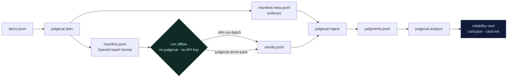

<p align="center">
  
</p>

<p align="center">
  <a href="https://github.com/Effram360/judgecal/actions/workflows/ci.yml"></a>
  <a href="https://pypi.org/project/judgecal/"></a>
  
  <a href="https://github.com/astral-sh/ruff"></a>
  
  <a href="LICENSE"></a>
  
</p>

<p align="center">
  <b>Statistically rigorous, batch-first reliability auditing for LLM judges and reward models.</b>
</p>

You grade your systems with an LLM judge. judgecal audits the judge: five behavioral
bias probes with real statistical inference (clustered bootstrap CIs, McNemar tests,
BH-FDR correction, power/MDE analysis), a synthetic planted-bias suite that validates
the instrument itself, and an offline batch workflow that runs judges on your own
GPUs via `vllm run-batch` or SLURM — no API key required anywhere in the pipeline.

## Why

LLM judges are measurably unreliable, and the failure modes are systematic, not noise.
The CALM taxonomy ([arXiv 2410.02736](https://arxiv.org/abs/2410.02736)) catalogs twelve
distinct judge biases. The magnitudes are not subtle: in a systematic study of pairwise
judging reported at IJCNLP 2025, the median model flipped its verdict on ~44.8% of
decisive pairs when the presentation order was swapped, with a mean first-position pick
rate of 63.3%.
And because every probe judges the same items repeatedly, naive
standard errors on judge metrics are wrong — per-item clustering must be accounted for
(Miller, *Adding Error Bars to Evals*, [arXiv 2411.00640](https://arxiv.org/abs/2411.00640)).

Most judge-evaluation tooling reports point estimates: a pick rate, an agreement score.
judgecal treats judge auditing as a measurement problem: every metric ships with a
confidence interval that respects the clustering structure, a p-value against an explicit
null, an FDR-corrected q-value, and a minimum detectable effect — so "no bias found"
is distinguishable from "this audit couldn't have found it."

## 60-second start

```bash
pip install judgecal
judgecal demo --n 150 --bias position=0.8 --seed 7
```

<p align="center">
  
</p>

The demo runs the full pipeline — synthetic items → probe suite → deterministic mock
judge with a planted position bias → analysis → reliability card — with zero LLM and
zero network. Real (abridged) output:

```markdown
# Judge Reliability Card — mock-judge (planted_bias={'beta_position': 0.8})

| **Scale** | 150 items · 2400 judgments · 5 probes |

## Summary

- **Position bias detected:** the judge picks the first-presented answer 64.7% of the
  time (95% CI 60.3%–69.2%, q = 0.002).
- **Underpowered — `pad_pick_rate`:** the smallest detectable effect at this sample
  size is 0.074, above the 0.050 effect-size-of-interest floor — this audit could not
  have detected effects as small as the floor. This null result is not evidence of
  absence.
- **Underpowered — `length_glm_coef`:** the smallest detectable effect at this sample
  size is 0.842, above the 0.500 effect-size-of-interest floor — this audit could not
  have detected effects as small as the floor. This null result is not evidence of
  absence.
- **Underpowered — `self_error_pick_excess`:** the smallest detectable effect at this
  sample size is 0.198, above the 0.050 effect-size-of-interest floor — this audit
  could not have detected effects as small as the floor. This null result is not
  evidence of absence.
- **High template sensitivity:** semantically equivalent prompt paraphrases change
  verdicts (Fleiss kappa = 0.59; worst template pair flips 30.4% of verdicts).

## Probes

### position

| Metric | Estimate [95% CI] | n | p | q | MDE | Verdict |
|:--|:--|--:|--:|--:|--:|:-:|
| `first_pick_rate` | 0.647 [0.603, 0.692] | 283 | <0.001 | 0.002 | 0.064 | ✗ |
| `flip_rate_decisive` | 0.361 [0.284, 0.445] | 133 | — | — | — | – |
| `positional_mcnemar` | 0.875 [0.753, 0.941] | 48 | <0.001 | <0.001 | 0.202 | ✗ |

**Flags:** `position_bias_detected`

... (verbosity, self_preference, template, stability probe sections elided) ...

*Verdict key:* ✗ null rejected (q < 0.05) · ✓ no signal at adequate power (MDE ≤
effect-of-interest floor) · ? no signal, underpowered for the floor · – descriptive
(no null) · obs. observational association (no causal verdict).
```

The planted 0.8 log-odds bias is recovered, significant after FDR correction, and
flagged. The other four bullets are honest reporting, not noise: at n=150 the pad,
GLM, and self-preference metrics are underpowered for their pre-registered
effect-size-of-interest floors and the card says so instead of issuing a clean bill
of health. And the template flag is a true positive — the demo's mock judge redraws
its verdict per distinct prompt body, so it *is* operationally template-sensitive;
its perfect stability metrics (kappa = 1.0 on identical repeated requests, shown in
the full output) pin the disagreement on the paraphrases rather than on run-to-run
noise.

## The five probes

| Probe | Question | Key metrics | Estimator | Null |
|:--|:--|:--|:--|:--|
| `position` | Does presentation order change the verdict? | `first_pick_rate`, `flip_rate_decisive`, `positional_mcnemar` | cluster bootstrap by item; Wilson CI; exact/mid-p McNemar on discordant pairs | 0.5 |
| `verbosity` | Does meaning-preserving padding win? | `pad_pick_rate` (experimental), `length_glm_coef` (observational association — quality–length correlation inflates it; rendered "obs.", never a verdict glyph) | cluster bootstrap over a constructed padded-vs-original contrast (both orders, so position cancels); logistic GLM with bootstrap CI | 0.5 / 0.0 |
| `self_preference` | Does the judge favor its own outputs when ground truth says it lost? | `self_error_pick_excess` | two-sample cluster bootstrap; an *unadjusted observational contrast* (both raw rates reported; a composition diagnostic suppresses the flag when the self/control sets differ in quality-gap composition) | 0.0 |
| `template` | Do equivalent prompt paraphrases agree? | `template_fleiss_kappa`, `template_max_flip`, `template_accuracy_range` | Fleiss' kappa with bootstrap CI; Wilson CI on worst pair | descriptive |
| `stability` | Are identical requests judged identically? | `unanimity_rate`, `mean_pairwise_flip`, `stability_fleiss_kappa` | Wilson CI; cluster bootstrap | descriptive |

Probes plan self-contained judgment requests (every covariate an analysis needs is
embedded at plan time), and identical request bodies are content-hashed and
deduplicated across probes — the position probe's `orig` pass and the stability
probe's first repeat are the same execution.

## We test the tester

A bias auditor that has never been tested against known biases is just vibes with
confidence intervals. judgecal ships a validation suite built on a deterministic mock
judge with *planted, analytically tractable* biases — position, verbosity,
self-preference, template sensitivity, and instability are injected at known log-odds
magnitudes, and the suite checks that every probe recovers the analytic truth within
its CI, reaches significance when it should, stays silent when it shouldn't, and
fires exactly the right flags:

```bash
judgecal validate          # fast: 7 scenarios, 30 checks, runs in CI
judgecal validate --full   # adds a 200-seed CI-coverage check (slow)
```

```text
judgecal validation — level=fast seed=7
scenario         check                                       observed                         status
---------------  ------------------------------------------  -------------------------------  ------
null             position.first_pick_rate CI covers null     est=0.5000 CI=[0.4842, 0.5158]   PASS
position         first_pick_rate CI covers analytic truth    est=0.6148 CI=[0.5915, 0.6426]   PASS
                 position_bias_detected fires                card flags=['position_bias_...]  PASS
...
OVERALL: PASS (7/7 scenarios, 30/30 checks)
```

The same machinery is exposed as `judgecal.validate.run_validation()` and exercised
in the test suite. The five closed-form estimators (Wilson CI, exact McNemar, BH-FDR,
Fleiss' kappa, logistic GLM) are cross-validated against statsmodels to machine
precision; the bootstrap/MDE machinery is validated by a 200-seed frequentist
coverage suite.

## Batch-first workflow

The audit pipeline requires no API key and never calls a hosted model API (the
optional `claude-run` smoke path below drives the Claude Code CLI under your local
subscription). It emits **OpenAI-batch-format JSONL manifests**
that `vllm run-batch` executes fully offline on your own GPU node (including
`/v1/score` for scalar reward models), plus a sidecar that maps results back to
probe usages. Manifests are content-hashed, deduplicated, and resumable.



```bash
# 1. Get items (any of the bundled dataset adapters, or your own JSONL)
judgecal datasets fetch llmbar --limit 200 -o items.jsonl   # needs: pip install 'judgecal[hf]'

# 2. Plan the probe suite into a batch manifest + sidecar
judgecal plan --items items.jsonl --probes position,verbosity,stability \
    --model qwen3.5-9b-awq -o run/
# manifest: run/manifest.jsonl (1600 batch lines, 1800 usages)
# sidecar:  run/manifest.meta.jsonl

# 3a. Run it wherever you have a GPU (no judgecal needed on that machine):
vllm run-batch -i run/manifest.jsonl -o run/results.jsonl --model qwen3.5-9b-awq

# 3b. ... or generate a ready-to-submit SLURM pack (vLLM + llama.cpp variants):
judgecal slurm-pack --manifest run/manifest.jsonl --model qwen3.5-9b-awq \
    --partition gpu --walltime 02:00:00 -o pack/
# wrote pack/run_vllm.sbatch, pack/run_llamacpp.sbatch, pack/README_RUN.md

# 4. Fan results back out to probe usages, analyze, get the card
judgecal ingest --sidecar run/manifest.meta.jsonl --results run/results.jsonl \
    -o run/judgments.jsonl
judgecal analyze --judgments run/judgments.jsonl --judge qwen3.5-9b-awq -o card/
```

Partial results? `judgecal plan ... --resume run/results.jsonl` writes a
`manifest.resume.jsonl` containing only the still-missing lines. The whole loop can
be dry-run offline — [`examples/batch_workflow.md`](examples/batch_workflow.md) walks
it end-to-end with a mock batch backend standing in for the GPU node.

### Claude Code smoke path (zero API key)

If you use Claude Code, you can smoke-test a manifest against a real LLM through
your existing subscription — no API key:

```bash
judgecal claude-run --manifest run/manifest.jsonl --sidecar run/manifest.meta.jsonl \
    -o run/judgments.jsonl --model sonnet --limit 25
```

This runs requests **sequentially through your Claude subscription quota** (the CLI
prints the same warning). It is a smoke path for checking templates and parsing on a
handful of items — not a study path. `--limit` defaults to 25 for exactly this reason.

## Inspect AI integration

With `pip install 'judgecal[inspect]'`, judgecal registers with
[Inspect AI](https://inspect.aisi.org.uk/) via the `inspect_ai` entry point:

```python
from inspect_ai import Task
from judgecal.integrations.inspect_ai import judgecal_pairwise, samples_df_to_judgments

# Score with the exact instrument judgecal audits (default pairwise
# template + [[A]]/[[B]]/[[C]] parser); samples carry metadata["first_text"]
# and metadata["second_text"]:
task = Task(dataset=samples, scorer=judgecal_pairwise(model="vllm/qwen3.5-9b-awq"))

# ... and pipe re-scored Inspect logs back into judgecal's probes:
judgments = samples_df_to_judgments(df)   # samples_df()-style dataframe
```

`inspect score --scorer judgecal/judgecal_pairwise` works on existing logs;
[`examples/inspect_demo.py`](examples/inspect_demo.py) runs both directions fully
offline against Inspect's `mockllm/model`.

## The statistics

Judgments are clustered (every probe judges each item multiple times), so all
interval estimates use a cluster bootstrap that resamples *items*, not judgments —
naive SEs would be spuriously tight (Miller, arXiv 2411.00640). Order-flip questions
use McNemar's test on discordant pairs, the natural paired design. Because one audit
tests many nulls at once, q-values come from a single Benjamini–Hochberg FDR
correction applied across all null-tested metrics in a card (one family per card,
pre-registered scope). And every null-tested metric reports its minimum detectable
effect at the realized sample size (two-sided, 80% power, computed from the realized
clustered bootstrap SE so it is consistent by construction with the printed CI).
Power adequacy is judged against pre-registered per-metric effect-size-of-interest
floors — never against the observed estimate, the post-hoc-power anti-pattern — so
underpowered nulls are flagged as such rather than read as clean bills of health.
The stats core (`judgecal.stats`) is standalone-importable — pure
numpy/scipy/pandas. The five closed-form estimators are cross-validated against
statsmodels to machine precision in the test suite; the bootstrap/MDE machinery is
validated by a 200-seed frequentist coverage suite (cluster-bootstrap CIs are known
to be anti-conservative below ~15 clusters, and judgecal warns on the card whenever
an estimate enters that regime).

## Related work

- **[RAND judge-reliability-harness](https://github.com/RANDCorporation/judge-reliability-harness)**
  ([arXiv 2603.05399](https://arxiv.org/abs/2603.05399)) — a judge-reliability harness
  predating judgecal; OpenAI-API-based. judgecal adds statistical inference (clustered
  CIs, McNemar, FDR, power/MDE), planted-bias validation of the instrument itself,
  offline batch manifests for local/cluster execution, and Inspect integration. A
  judgecal-vs-JRH agreement comparison is planned.
- **[cje-eval](https://pypi.org/project/cje-eval/)** (used by Inspect's
  `judge_calibration_diagnostics` script) — isotonic calibration of judge scores to
  oracle labels. Complementary: calibration-to-oracle rather than behavioral bias
  probes; judgecal may wrap it as an optional extra.
- **UW-Madison, *How to Correctly Report LLM-as-a-Judge Evaluations***
  ([arXiv 2511.21140](https://arxiv.org/abs/2511.21140)) — the statistical-reporting
  half of this problem, as a paper. judgecal operationalizes that style of rigor and
  pairs it with the probes, the validation suite, and the batch execution layer.
- **[hankimis/llm-judge-bench](https://github.com/hankimis/llm-judge-bench)**
  (concurrent, May 2026) — a ground-truth-scored judge benchmark that also ships
  position/verbosity/self-preference probes with a mock judge, for API judges
  (OpenAI/Anthropic). Differs in the lanes judgecal centers on: statistical inference,
  instrument validation, offline/local batch execution, and Inspect integration.
- **Diagnosing the Reliability of LLM-as-a-Judge via IRT**
  ([arXiv 2602.00521](https://arxiv.org/abs/2602.00521), ICML 2026) — item-response-theory
  diagnosis of judge reliability; methodology rather than tooling.

## Roadmap

- **Quantized-judge study** — *does quantization break a judge's reliability before it
  breaks its benchmark scores?* To our knowledge, the first systematic study of
  quantization effects on judge reliability (as of June 2026): generative judges and
  scalar reward models across a BF16→FP8→AWQ/GPTQ→GGUF Q8–Q3 ladder, run as SLURM
  batch arrays through this exact pipeline, with a **pre-registered power analysis**
  before any run — a null result is a publishable finding, not a failure. Raw
  judgments will be published. Closest adjacent work: *Reliability Scaling Laws for
  Quantized Large Language Models* (ICLR 2026 submission,
  [OpenReview QhkW8xPH1v](https://openreview.net/forum?id=QhkW8xPH1v)) studies
  quantized models as evaluation *subjects*; no work we know of studies quantization
  of the *judge*.
- **Dataset adapters** — bundled now (each `load()` needs `judgecal[hf]`):

  | Adapter | HF path | License |
  |:--|:--|:--|
  | `rewardbench2` | allenai/reward-bench-2 | ODC-BY |
  | `llmbar` | princeton-nlp/LLMBar | MIT |
  | `mtbench_human` | lmsys/mt_bench_human_judgments | CC-BY-4.0 |
  | `judgebench` | ScalerLab/JudgeBench | not verified |
  | `rmbench` | THU-KEG/RM-Bench | not verified |

  More adapters and an items-JSONL cookbook are planned; `judgecal datasets list`
  always shows the current registry with licenses.
- **JRH agreement study** — same judges, both instruments, do the audits agree?

## License

MIT — see [LICENSE](LICENSE).

## Citing

If judgecal is useful in your research, please cite it (see also
[`CITATION.cff`](CITATION.cff)):

```bibtex
@software{judgecal2026,
  author  = {{Eff360}},
  title   = {judgecal: Statistically rigorous, batch-first reliability
             auditing for LLM judges and reward models},
  year    = {2026},
  url     = {https://github.com/Effram360/judgecal},
  version = {0.1.0}
}
```
